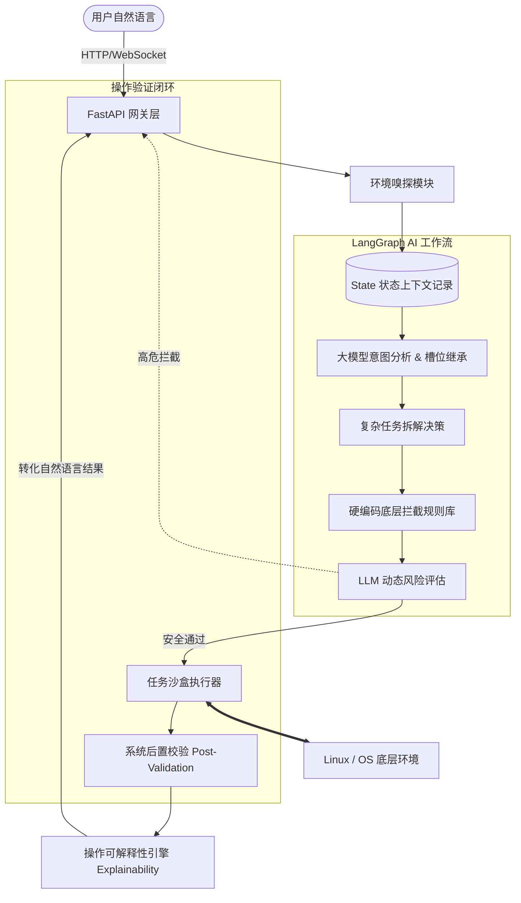

# OS Agent 🤖 — 操作系统智能管理代理

基于 **LangGraph** 和大语言模型（LLM）驱动的 AI-Native 操作系统智能代理。该项目旨在探索“去命令行化”的新一代服务器交互范式，允许用户通过自然语言完成从基础设施监控、故障排查到高危拦截的复杂服务器管理工作。

---

## 📖 项目简介

在传统的 Linux 运维中，用户需要熟记大量的 CLI 命令，并深刻理解不同 Linux 发行版（Ubuntu、CentOS、openEuler 等）之间的差异。**OS Agent** 的出现解决了“人机沟通门槛过高”的痛点：
用户只需输入人类语言（例如：“*排查一下 80 端口无法访问的原因并在修复后重启对应服务*”），OS Agent 就会自动分析当前 OS 环境、把庞大的任务拆分为多个子链条并逐一去底层执行，最后通过人类语言向您报告排查结果。

我们不仅是一个命令转发器，还是一个具有**多轮上下文记忆**、**双重风险管控**以及**后置状态校验**的生产级运维虚拟人。

---

## 🏗️ 架构设计与实现方式

### 核心架构图 (Architecture)

本系统全面采用图数据流驱动机制，抛弃了传统的“提示词硬拼凑”流水线，以实现高鲁棒性的智能体协作。

### 为什么选择 LangGraph 架构？（核心优势）

OS Agent 强依赖于 **LangGraph** 状态机模型，而非普通的 LangChain Agent 或纯 prompt 工程。这带来了显著的工业级优势：

1. **图灵完备的执行循环 (Cyclic Logic)**：普通的 Agent 是单向推理，如果遇到报错很容易崩溃；而在 LangGraph 中，我们在执行错误时可以通过图的 "Edges" 逻辑无缝回到重组阶段（Retry Loop），让系统产生“自我反思”和“错误治愈”能力。
2. **多轮记忆的严格继承 (Stateful Context)**：在 LangGraph 中，状态 (`State`) 随着执行流流转，能精准保留您的每一轮对话、每一个历史目录，甚至记录哪些风险刚得到了人工授权，保证极高的上下文准确度。
3. **安全拦截检查点 (Human-in-the-loop / Checkpoint)**：通过 LangGraph 特有的中断运行机制，我们完美实现了高危指令（如 `rm -rf`）挂起。只有当用户在 GUI 上明确点击“确认执行”后，大图节点才接着继续推进，杜绝意外越权。
4. **多任务并行与串行编排**：面对极其复杂的自然语言，Agent 能将其分解成一条 `TaskSequence` 任务链依次在图中流转执行。

---

## ✨ 核心特性

- **🛡️ 生产级双规风控**：前置“硬编码正则规则库（防逃逸）” + 后置“大模型动态语义风险评估（防社工越权）”。
- **🔍 操作验证闭环 (Post-validation)**：发出的操作不仅看退出码，项目还自建了探针，强校验操作是否符合客观物理状态（如创建用户后验证 `/home` 是否构建成功等）。
- **🌈 可解释性引擎**：拒绝只会打印一坨 log 的机器人形式。每次产生风险分析与错误时，都会用自然语言向用户呈现其后果、推导依据，透明可靠。
- **🌍 环境自适应嗅探**：通过 `EnvironmentTools` 后台动态判定服务器架构底层是 Debian 系 还是 RedHat 系，从而为模型挂载准确的依赖。

---

## 🛠️ 运行环境与依赖 (Tech Stack)

### 环境要求
- **操作系统**：支持 Linux (Ubuntu, openEuler, CentOS, Rocky) 与 Windows（可作为中控端连接测试）
- **Python 版本**：Python 3.10 及以上
- **包管理器**：pip & venv

### 核心依赖栈
- **AI 智能调度**：`langgraph` / `langchain` / `langchain-openai`
- **语言模型**：Minimax API / OpenAI API (可配置)
- **后端服务**：`FastAPI` / `uvicorn` (含高并发 WebSocket)
- **前端交互**：纯净无依赖 HTML5 + Vanilla JS / `marked.js`
- **本地审计存储**：`sqlite3`

> 完整项目清单请参见 `requirements.txt`。

---

## 🚀 部署与使用

为了让本系统顺利进驻物理局域网、云服务器的不同操作系统发行版，我们编写了非常详尽的分支平台部署说明，并配备了带色彩与环境自愈功能的自动化脚本。

🔗 **[>>> 请点击此处阅读 《OS-AGENT 部署与启动文档 (DEPLOY.md)》 <<<](./DEPLOY.md)**

---

## 📜 许可证 (License)

本项目开源节流规则遵循 **MIT License**。

欢迎探讨基于操作系统的代理自动化交互的更多无限可能。
